<div align="center">

# 👋 Gustavo Barbosa

### Analista de Implantação • Infraestrutura • Redes • DevOps • Engenharia de Software

[](https://git.io/typing-svg)

<br>

<a href="https://www.linkedin.com/in/gustavo-barbosa-ti/">

</a>

<a href="https://github.com/gustavoguga18">

</a>

</div>

---

## 💻 Sobre mim

```python
class Gustavo:
    def __init__(self):
        self.nome = "Gustavo Barbosa"
        self.cargo = "Analista de Implantação"
        self.localizacao = "Fortaleza, Ceará, Brasil"

        self.atuacao = [
            "Implantação de sistemas",
            "Infraestrutura",
            "Redes",
            "CFTV",
            "Integração de sistemas",
            "Troubleshooting"
        ]

        self.tecnologias = [
            "Linux",
            "Docker",
            "Git",
            "APIs",
            "Bancos de dados",
            "n8n",
            "JavaScript",
            "TypeScript",
            "Python"
        ]

        self.formacao = "Engenharia de Software"

        self.estudando = [
            "DevOps",
            "Cloud Computing",
            "CI/CD",
            "Backend",
            "Kubernetes",
            "Arquitetura de Software",
            "Inteligência Artificial"
        ]
```

🔧 Atualmente trabalho com **implantação e suporte técnico**, atuando na configuração, integração e troubleshooting de soluções de tecnologia.

🌐 Experiência prática com **redes, infraestrutura, CFTV, sistemas operacionais, equipamentos de rede e integração de sistemas**.

🐧 Em projetos pessoais e estudos, trabalho com **Linux, Docker, bancos de dados, APIs, automação e CI/CD**.

💻 Desenvolvo projetos próprios para transformar conhecimentos teóricos em aplicações reais.

🎓 Estudante de **Engenharia de Software**.

🌱 Atualmente aprofundando conhecimentos em **DevOps, Cloud, Backend e Arquitetura de Software**.

🤖 Interesse especial em **automação, Inteligência Artificial, observabilidade e integração de sistemas**.

---

# 🛠️ Tecnologias & Ferramentas

### 💻 Linguagens

<p>

</p>

### ⚙️ Backend & Frameworks

<p>

</p>

### 🐳 DevOps & Infraestrutura

<p>

</p>

`CI/CD` • `Zabbix` • `Grafana` • `n8n`

### 🗄️ Bancos de Dados

<p>

</p>

### ☁️ Cloud & Automação

<p>

</p>

`REST APIs` • `Webhooks` • `n8n` • `IA` • `Automação`

### 🌐 Redes & Infraestrutura

`TCP/IP` • `VLAN` • `DHCP` • `DNS`

`FTTH/FTTX` • `CFTV` • `PoE`

`Linux` • `Windows` • `Docker` • `Troubleshooting`

---

# 🚀 Projetos em Destaque

## 🎄 Amigo Secreto da Família

Aplicação web desenvolvida para organizar o **amigo secreto da família**, permitindo gerenciamento de participantes, presentes, acessos e interação dos usuários.

### 🧰 Tecnologias

`Node.js` `Express` `JavaScript` `Supabase` `Render`

### ✨ Recursos

* 👥 Gerenciamento de participantes
* 🎁 Cadastro e gerenciamento de presentes
* 🔐 Acesso individual por participante
* 📊 Registro de acessos
* 🖼️ Upload de imagens dos presentes
* 📱 Interface responsiva
* ☁️ Deploy em produção

🔗 **[Ver repositório](https://github.com/gustavoguga18/amigosecret)**

---

## 📱 Cadê?

Aplicativo mobile desenvolvido para solucionar um problema simples:

> **"Onde eu guardei isso?"**

Permite registrar objetos, locais, detalhes, categorias, observações e fotos.

### 🧰 Tecnologias

`React` `TypeScript` `Vite` `Capacitor` `Android`

### ✨ Recursos

* 📦 Cadastro de objetos
* 📍 Localização onde o objeto foi guardado
* 📝 Detalhes e observações
* 🏷️ Categorias
* 📷 Registro de fotos
* 📱 Aplicativo Android
* 💾 Armazenamento local

---

## 📊 Monitoramento com Zabbix + Grafana

Laboratório de monitoramento desenvolvido para estudar **observabilidade, infraestrutura e monitoramento de serviços**.

### 🧰 Tecnologias

`Zabbix` `Grafana` `Docker` `Linux`

### ✨ Objetivos

* 📈 Monitoramento de infraestrutura
* 🖥️ Monitoramento de hosts
* 📊 Dashboards
* 🚨 Alertas
* 🐳 Containers Docker
* 📡 Coleta e visualização de métricas

---

## 🤖 Automação com n8n + IA

Projetos de automação utilizando **n8n, APIs, Webhooks e Inteligência Artificial**.

### 🧰 Tecnologias

`n8n` `REST API` `Webhooks` `IA` `JSON`

### ✨ Aplicações

* 🤖 Chatbots
* 🔄 Automação de processos
* 🔌 Integração entre APIs
* 🧠 Fluxos com IA
* 📩 Processamento de informações
* ⚡ Workflows automatizados

---

# 📚 Atualmente estudando

```text
🐳 DevOps
├── Linux
├── Docker
├── CI/CD
├── Git & GitHub
├── Observabilidade
└── Containers

☁️ Cloud
├── AWS
├── Cloud Architecture
├── Networking
└── Infrastructure as Code

💻 Backend
├── Node.js
├── APIs REST
├── Bancos de dados
└── Arquitetura de software

🏗️ Engenharia de Software
├── Clean Code
├── SOLID
├── Design Patterns
├── Arquitetura
└── Testes

🤖 Automação & IA
├── n8n
├── APIs
├── LLMs
└── Agentes de IA
```

---

# 📊 GitHub Stats

<div align="center">

<a href="https://github.com/gustavoguga18">





</a>

</div>

---

# 🔥 GitHub Streak

<div align="center">


</div>

---

# 📈 Atividade no GitHub

<div align="center">


<br><br>

<a href="https://raw.githubusercontent.com/gustavoguga18/gustavoguga18/activity-assets/activity-30d.svg">
  30 dias
</a>

&nbsp;•&nbsp;

<a href="https://raw.githubusercontent.com/gustavoguga18/gustavoguga18/activity-assets/activity-90d.svg">
  90 dias
</a>

&nbsp;•&nbsp;

<a href="https://raw.githubusercontent.com/gustavoguga18/gustavoguga18/activity-assets/activity-365d.svg">
  365 dias
</a>

</div>

---

# 🧰 Ambiente de Desenvolvimento

```text
OS              → Linux / Windows
Editor          → VS Code
Versionamento   → Git / GitHub
Containers      → Docker
Database        → PostgreSQL / MySQL / SQLite
Monitoring      → Zabbix / Grafana
Automation      → n8n
Backend         → Node.js / Python
Frontend        → React / TypeScript
Cloud           → AWS
```

---

# 🎯 Objetivos

```text
                         Engenharia de Software
                                  │
                ┌─────────────────┼─────────────────┐
                │                 │                 │
                ▼                 ▼                 ▼
             Backend            DevOps            Cloud
                │                 │                 │
                │                 ▼                 │
                │                CI/CD              │
                │                 │                 │
                └─────────────────┼─────────────────┘
                                  │
                                  ▼
                           Arquitetura de Software
                                  │
                                  ▼
                     Sistemas robustos e escaláveis
```

---

# 🤝 Vamos nos conectar?

<div align="center">

<a href="https://www.linkedin.com/in/gustavo-barbosa-ti/">

</a>

<a href="https://github.com/gustavoguga18">

</a>

</div>

<br>

<div align="center">

### 💻 Transformando problemas reais em soluções de tecnologia.

</div>
